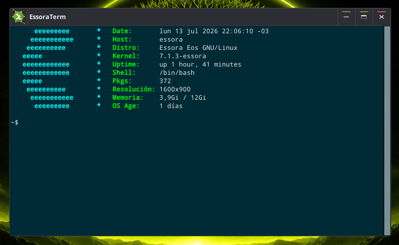
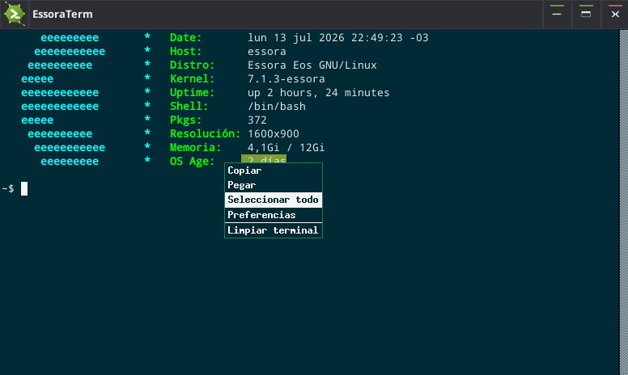
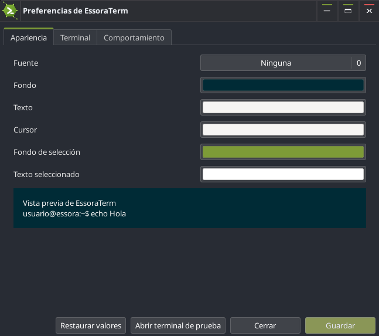

# EssoraTerm

<p align="center">
  
</p>

<p align="center">
  <strong>A lightweight xterm fork created by josejp2424 for Essora Linux and Puppy Linux.</strong>
</p>

<p align="center">
  Native X11 terminal emulator • C/GTK3 preferences • Multilingual interface
</p>

## About

**EssoraTerm** is a lightweight fork of `xterm`, created and maintained by
**josejp2424** for **Essora Linux**, **EssoraPup**, and **Puppy Linux**.

The project preserves xterm's speed, stability, low memory usage, and broad
terminal compatibility while providing a more familiar desktop experience.

This release is based on **xterm patch #410** and adds:

- a persistent right-click context menu;
- standard clipboard copy and paste;
- a native graphical preferences application written in C and GTK3;
- automatic interface language detection;
- EssoraTerm branding and icons;
- a user-friendly scrollbar;
- compatibility links for applications that expect `xterm`.

EssoraTerm does not use Python.

## Screenshots

### EssoraTerm

<p align="center">
  
</p>

## Main Features

- Select text normally with the left mouse button and drag.
- Open a persistent context menu with the right mouse button.
- Close the context menu by clicking outside it.
- Highlight menu entries in Essora green while moving the pointer.
- Copy selected text to the desktop clipboard.
- Paste text copied from browsers, editors, file managers, or other terminals.
- Select the complete terminal screen and scrollback history.
- Open the graphical preferences application from the context menu.
- Clear the terminal from the context menu.
- Use `Ctrl+Shift+C` to copy.
- Use `Ctrl+Shift+V` to paste.
- Use `Shift + right click` for xterm's original selection-extension behavior.
- Use `Ctrl + right click` to open xterm's original font menu.
- Use a wide, draggable scrollbar on the right side.
- Preserve compatibility through `/usr/bin/xterm -> essoraterm`.
- Preserve `TERM=xterm-256color`.

## Context Menu

The default context menu contains:

<p align="center">
  
</p>

```text
Copy
Paste
Select All
Preferences
Clear Terminal
```

The labels are automatically translated according to the system locale.

## Graphical Preferences

The `essoraterm-settings` application is written in native C with GTK3.

<p align="center">
  
</p>

It allows each user to configure:

### Appearance

- font family;
- font size;
- background color;
- foreground color;
- cursor color;
- selection background color;
- selected-text color;
- bold-font support;
- live appearance preview.

### Window and History

- initial number of columns;
- initial number of rows;
- scrollback history size;
- scrollbar visibility;
- scrollbar position;
- scrollbar width.

### Cursor and Behavior

- block cursor;
- underline cursor;
- vertical-bar cursor;
- blinking cursor;
- visual bell;
- scroll to the bottom when typing;
- scroll to the bottom when new output appears.

The graphical preferences application can be opened with:

```sh
essoraterm-settings
```

or:

```sh
essoraterm --preferences
```

It is also available through the **Preferences** entry in the right-click
context menu.

## Per-User Configuration

Each user's settings are stored in:

```text
~/.config/essoraterm/settings.conf
```

A small native C launcher reads this file and passes the selected preferences
to the real terminal binary through X resources.

This design:

- does not modify `~/.Xresources`;
- does not require `xrdb`;
- does not affect other users;
- works in both root-based Puppy systems and regular multi-user systems;
- applies changes to newly opened EssoraTerm windows.

The real terminal emulator is installed as:

```text
/usr/lib/essoraterm/essoraterm-bin
```

The user-facing launcher is:

```text
/usr/bin/essoraterm
```

## Supported Languages

English is the default and fallback language.

The context menu and graphical preferences application support:

```text
en  English
ar  Arabic
es  Spanish
ca  Catalan
de  German
fr  French
it  Italian
pt  Portuguese
hu  Hungarian
ru  Russian
ja  Japanese
zh  Chinese
```

EssoraTerm detects the system language automatically.

## Icons and Branding

EssoraTerm uses its own icon set exclusively.

Included formats and sizes:

- scalable SVG;
- PNG 16×16;
- PNG 24×24;
- PNG 32×32;
- PNG 48×48;
- PNG 64×64;
- PNG 128×128;
- PNG 256×256;
- embedded 48×48 XPM icon for the terminal binary.

The package removes the original xterm desktop icons and desktop entries from
the generated EssoraTerm package.

## Source Layout

Important project paths include:

```text
assets/                     EssoraTerm icons and graphical resources
config/                     Default application configuration
debian/                     Debian package metadata and maintainer scripts
scripts/                    Build, dependency, and validation scripts
src/                        EssoraTerm-specific C source code
source/                     Optional local xterm source archive
screenshot/                 Project screenshots
build-deb.sh                Main build and packaging script
COPYING                     Original xterm license notices
LICENSE-ESSORATERM          License for EssoraTerm-specific code
NOTICE                      Attribution and licensing summary
README.md                   Project documentation
```

## Build Requirements

### Debian, Devuan, or Essora Linux

Run the dependency installer as root:

```sh
./scripts/install-build-deps.sh
```

The build requires tools and development packages for:

- GCC and standard build tools;
- Debian package creation;
- `pkg-config`;
- X11;
- Xt;
- Xaw;
- Xmu;
- Xpm;
- Xft;
- Fontconfig;
- Xinerama;
- ICE and SM;
- GTK3.

The helper installs the required packages without using `sudo`.

You can check the build environment manually with:

```sh
./scripts/check-build-deps.sh
```

### Puppy Linux or EssoraPup

Load the **DEVX that exactly matches the running ISO**.

The DEVX must provide the compiler, headers, `pkg-config`, GTK3 development
files, and the required X11 development libraries.

Then run:

```sh
./scripts/check-build-deps.sh
```

Do not compile against a DEVX from a different Puppy or EssoraPup release.

## Building EssoraTerm

Clone or extract the source tree, then enter the project directory:

```sh
cd essoraterm-source
```

Run the complete build and packaging process:

```sh
./build-deb.sh
```

If the following archive is not present:

```text
source/xterm-410.tgz
```

the build script downloads the official xterm patch #410 source automatically.

The generated Debian package is written to:

```text
dist/essoraterm_1.1.0-1_ARCH.deb
```

For an AMD64 build, the expected filename is:

```text
dist/essoraterm_1.1.0-1_amd64.deb
```

## Installing the Package

As root:

```sh
dpkg -i dist/essoraterm_1.1.0-1_amd64.deb
```

After installation, start the terminal with:

```sh
essoraterm
```

Applications that execute `xterm` continue to work through the compatibility
link.

## Installed Files

The package installs the main files in these locations:

```text
/usr/bin/essoraterm
/usr/lib/essoraterm/essoraterm-bin
/usr/bin/essoraterm-settings
/usr/bin/xterm -> essoraterm
/usr/bin/uxterm -> essoraterm
/etc/X11/app-defaults/EssoraTerm
/usr/share/applications/essoraterm.desktop
/usr/share/applications/essoraterm-settings.desktop
/usr/share/icons/hicolor/.../apps/essoraterm.*
/usr/share/pixmaps/essoraterm.png
/usr/share/doc/essoraterm/
```

## Compatibility

EssoraTerm retains xterm-compatible terminal behavior.

```text
TERM=xterm-256color
```

The following compatibility links are installed:

```text
/usr/bin/xterm -> essoraterm
/usr/bin/uxterm -> essoraterm
```

Commands using xterm arguments remain supported, including:

```sh
xterm -e sh -c 'echo "Hello from EssoraTerm"'
```

## Project Validation

Run:

```sh
./scripts/check-project.sh
```

The validation script checks:

- shell-script syntax;
- project structure;
- required resources;
- icon files;
- launcher compilation;
- configuration generation;
- GTK3 preferences source when GTK3 development headers are available.

## Design Goals

EssoraTerm is designed to remain:

- lightweight;
- fast to start;
- suitable for older and low-resource computers;
- fully usable in Puppy Linux;
- compatible with Essora Linux;
- independent from Python;
- familiar to users of modern graphical terminals;
- compatible with software that expects xterm.

## Credits

### EssoraTerm

- Fork, modifications, graphical preferences, integration, translations,
  packaging, and maintenance: **josejp2424**
- Project: **Essora Linux**

### Original xterm Project

EssoraTerm is based on xterm.

The original xterm source includes work and copyright notices from:

- Thomas E. Dickey;
- X Consortium;
- Digital Equipment Corporation;
- other contributors listed in the original source and documentation.

Original xterm project:

```text
https://invisible-island.net/xterm/
```

## License

EssoraTerm contains code under more than one compatible permissive license.

The original xterm code remains under its original MIT/X11-style license terms
and copyright notices. See:

```text
COPYING
```

EssoraTerm-specific source code, modifications, translations, configuration
tools, original assets, and packaging scripts are distributed under the MIT
License. See:

```text
LICENSE-ESSORATERM
```

The original copyright and permission notices must remain included when
redistributing substantial portions of the xterm-derived source.

See `NOTICE` for a concise attribution and licensing summary.

---

<p align="center">
  <strong>EssoraTerm — a lightweight terminal for Essora Linux and Puppy Linux.</strong>
</p>
